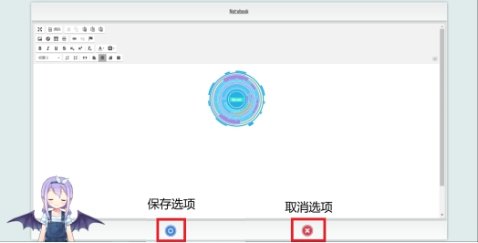

# 笔记分享系统

## 设计需求分析

-  实现登录注册账号功能且能够找回密码。
- 能够检索共享自己与别人的笔记。
- 能够富文本编辑笔记,增删查改操作.
- 能够发布弹幕功能。
- 能够查看自己的笔记操作记录情况.
- 

## 基本功能

- 用户基本功能：用户可以通过账号注册来获取自己的账号，然后可以登录到笔记共享系统里面。当用户忘记自己的密码的时候，可以通过找回密码的功能，来找回自己的秘密。
-   弹幕功能：用户登录自己的账号后可以通过弹幕与其他人进行交流。
- 用户操作：用户可以增添，删除，检索数据库里面的笔记，还可以查看自己的笔记记录。
- 趣味交互功能：用户可以和网页上的卡通人物进行互动。

## 系统设计

### 登录模块流程

技术细节：

用addAttribute进行登录属性的添加，getAttribute进行登录信息的获取，setAttribute进行登录信息的设置。用invalidate清除登录的session，登录信息错误时使用return返回到login登录界面。除了login登录界面是可以公开访问外，其他url都进行了拦截控制。同时密码保护采用md5加密方式等。

### 主模块流程

技术细节：

WEBGL技术,使用webgl构建主界面的3d圆柱笔记模板效果；使用springmvc+jsp来搭建技术后台服务；使用NOSQL数据库mongodb做数据持久化；并自定义404页面。

### 弹幕模块流程

技术细节：

使用ArrayList动态数组，以便进行弹幕的增加和减少；通过遍历弹幕数据表结合js：window_width = $(window).width() + 500等实现弹幕特效，实时发送弹幕。同时设置定时器来进行弹幕的接连发射

### 个人笔记模块流程

技术细节：

笔记内添加了ckeditor文本编辑器，使用户在页面内就可以进行文本、图片、格式等的编辑，实现笔记的增删改功能。运用getAttribute、get等方法等来设置setId、setNotename、setAuther、setNotetext等自定义方法中的数据。使用simpleDateFormat方法来获取个人笔记添加时的时间。验证id信息移植后，在删除时使用remove（）函数进行笔记的删除，使用find（）函数和findOne（）函数进行个人笔记的检索以显示个人笔记。

### 笔记检索模块流程

技术细节：

搜索条件使用where函数，使用find（）函数和findOne（）函数进行笔记的遍历检索。

### 用户操作纪录模块流程

技术细节：

通过elements.length遍历用户创建笔记的历史事件，并通过js产生时间线效果。

### 核心技术---3D效果模块

1.WEBGL技术,使用webgl构建主界面的3d圆柱笔记模板效果

## 功能测试

测试各个功能模块是否工作正常，以及容错功能。

### 系统首页

### 用户登录界面

### 用户注册界面

### 忘记密码界面

### 主界面

### 笔记查看

### 弹幕功能

### 功能选项栏

### 个人中心

### 笔记添加

### 删除笔记

### 用户操作纪录

### 笔记文件检索

### 40x或50x错误有自定义错误页面

